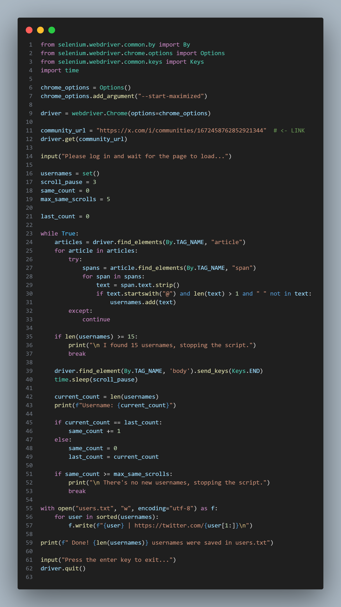
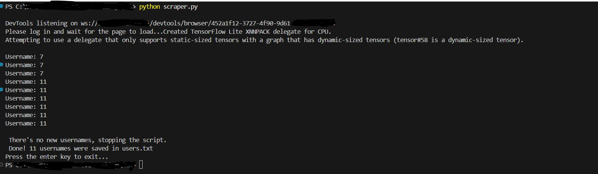

# 🕵️‍♂️ Twitter (X) Community Username Scraper

This project uses **Selenium** to automatically extract up to 15 unique Twitter usernames from a public X (formerly Twitter) community.

---

## 📦 Requirements

Make sure you have the following installed:

- Python 3.8+
- Google Chrome
- ChromeDriver matching your Chrome version  
- Pip (Python package manager)

---

## ⚙️ Installation

 Install dependencies:

```bash
pip install selenium
```
---
## <em> IMAGE WITH CODES </em>



## <em> TERMINAL </em>



---


# 📌 Project Overview
This project is a Twitter/X Community Scraper built with Python and Selenium WebDriver. Its main purpose is to extract a list of up to 15 unique usernames from a public Twitter community page, by mimicking user interaction through automated browser control.

---

# 🎯 Purpose
Since Twitter/X API access has become limited and often requires paid tiers or approval, this scraper provides a simple and legal alternative for small-scale data collection when:

You want to gather a few usernames for community engagement or marketing,

You're conducting academic research or sentiment analysis,

You’re testing automation techniques in dynamic web environments.

---

# ❗ The scraper does not bypass authentication or access private data — it waits for manual login by the user, making it compliant with basic terms of service.
---

# 🔍 How It Works
It launches a Chrome browser using Selenium.

The user logs into Twitter manually.

The script scrolls through the community page.

It collects usernames that begin with @ from tweet elements.

The script stops automatically when either:

15 unique usernames have been collected, or

no new usernames are found after multiple scrolls.

It saves the results in a file: users.txt.

The logic is lightweight, reliable for small batches, and uses standard libraries that are easy to install.

---
# Example OUTPUT in users.txt:
``` bash
@elonmusk | https://twitte.com/elonmusk
@techinsider | https://twitter.com/techinsider
```